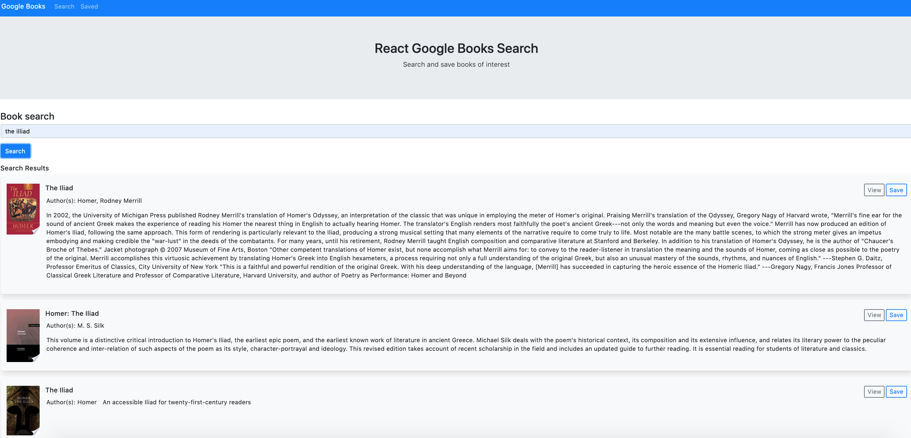

# react-google-book-search

## About
A Google Books React Application with a search interface connected to a database where users can find books, preview them and add or remove them from a collection.



## Getting Started

These instructions will get you a copy of the project up and running on your local machine for development and testing purposes.

### Installation

If you are cloning/downloading the GitHub repo, please be sure to use the package manager [NPM](https://www.npmjs.com/) to install the needed packages for the project to run through node and express:

```bash
NPM dependencies:
    "@restart/context": "^2.1.4",
    "axios": "^0.18.0",
    "dotenv": "^8.0.0",
    "express": "^4.16.3",
    "if-env": "^1.0.4",
    "mongoose": "^5.3.16",
    "morgan": "^1.9.1"
```
This can be done by running the below code for each dependency

```bash
npm install [program]
```

or you can simply run the below:

```bash
npm i
```

## How to run the program

The application is hosted through heroku and is available at the below link.

https://mysterious-mountain-90471.herokuapp.com/

## Technology
- React, MongoDB, Mongoose, Node, Express, Morgan, Axios, Javascript

## Contributing Guidelines
All contributions and suggestions are welcome! For direct contributions, please fork the repository and file a pull request.

## Contributors
@bwillstorey

## Contact
#### Developer/Full-stack Web Software Developer
- Homepage: https://brianstorey.me 
- email: bwillstorey@gmail.com
- LinkedIn: https://www.linkedin.com/in/brianstorey/
